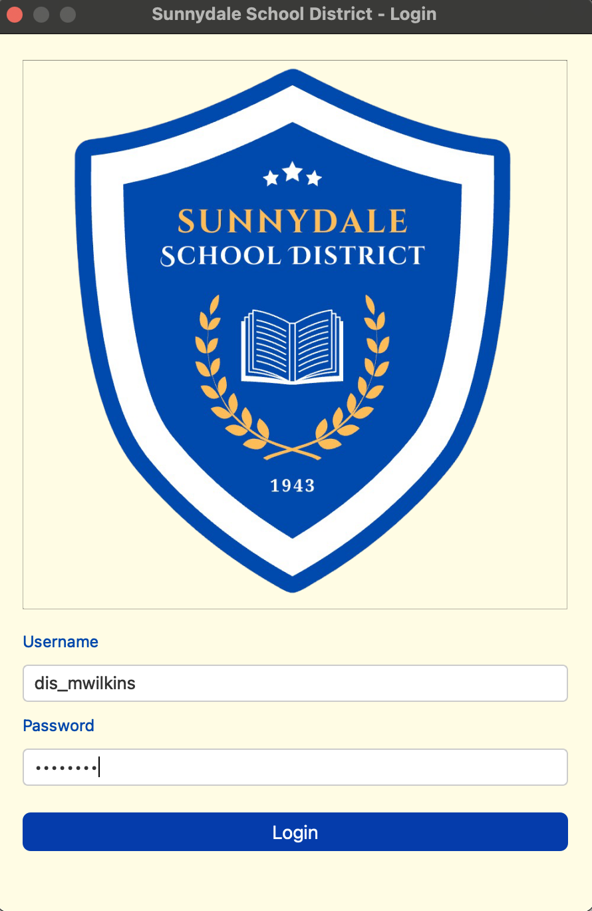
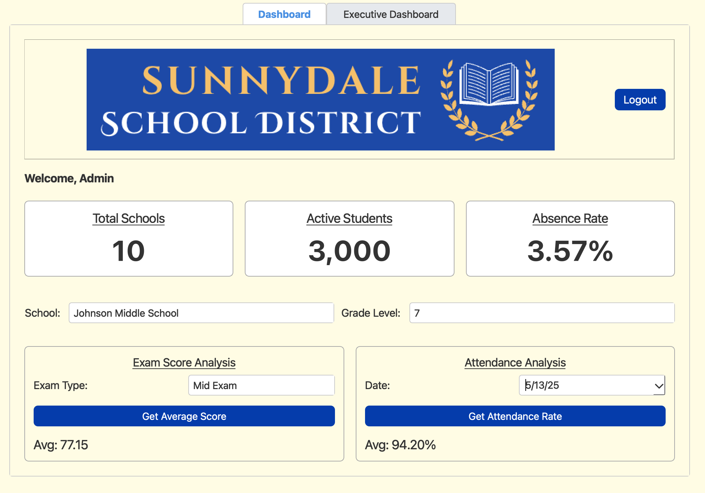
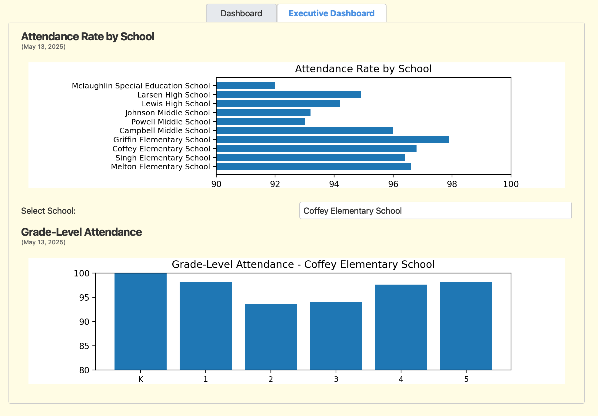
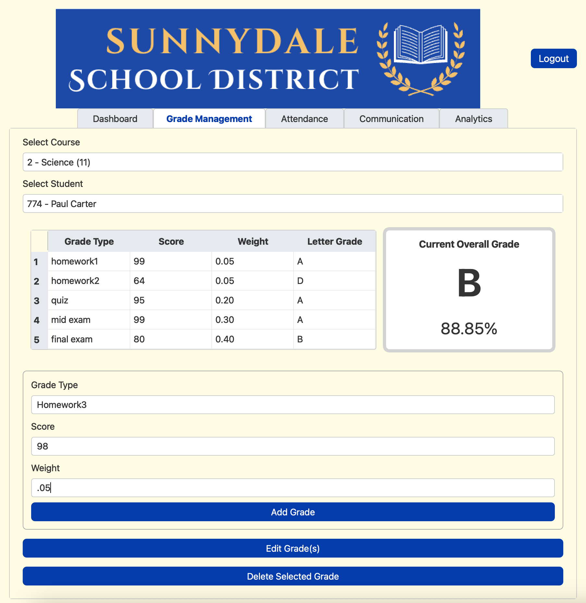
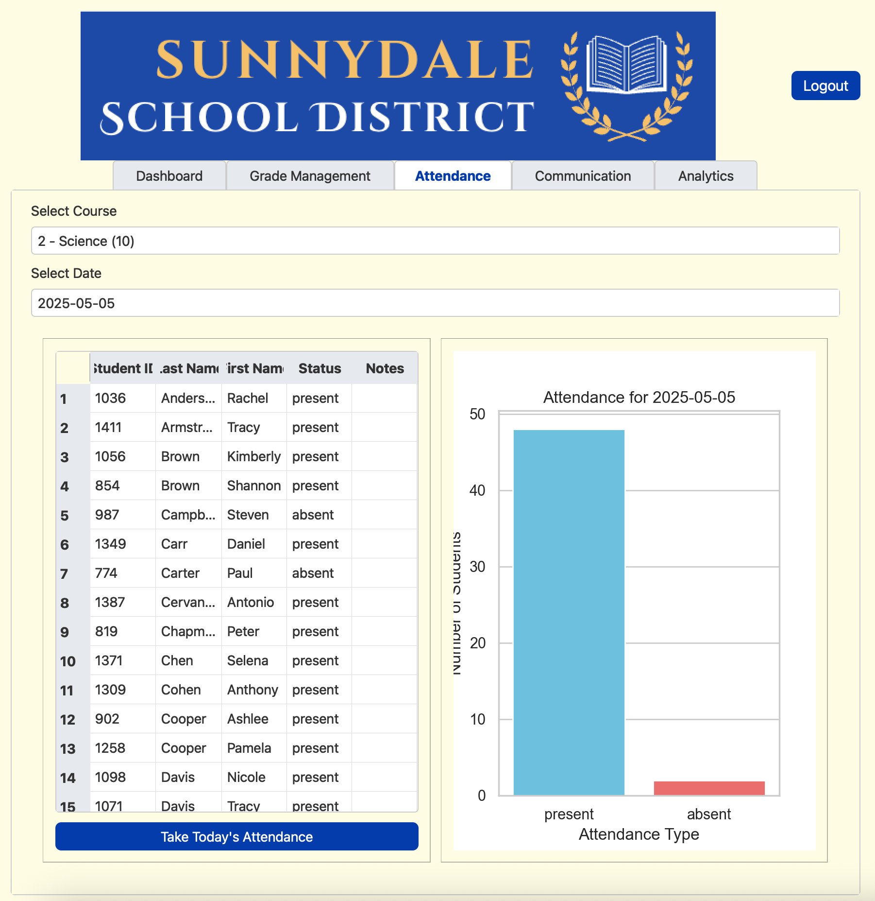
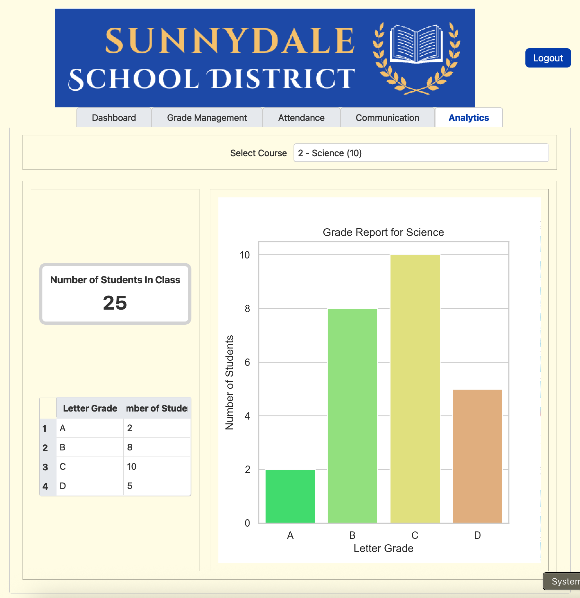

# School District Management System

A database-driven application for managing academic data across multiple schools within a district. The platform integrates a **graphical user interface (GUI)** with both an **operational database** (for day-to-day tasks) and an **analytical database** (for reporting and insights).

---

## Overview
The system centralizes school operations and provides **role-based access** for students, guardians, teachers, and administrators. Each user has a tailored experience:

- **Teachers**: record attendance, enter grades, manage courses  
- **Students**: view grades, attendance, and enrollment  
- **Guardians**: monitor their child’s progress and communicate with teachers  
- **Administrators**: oversee district-wide performance and generate analytical reports  

---

## Features
- Add, view, and modify **student, teacher, guardian, and administrator** profiles  
- Enroll students in courses and assign teachers  
- Record **attendance** and update **grades**  
- Role-based access with **personalized dashboards**  
- District-level reporting on **performance and attendance trends**  

---

## Architecture
- **Operational Database**: Supports real-time updates as users interact with the system  
- **Analytical Database**: Star schema designed for dimensional modeling and reporting (e.g., attendance rates, grade distributions)  
- **GUI**: Intuitive interface for data entry, queries, and dashboards  

---

## Tech Stack
- **Backend/Database**: MySQL (migrated demo version available in SQLite for portability)  
- **Frontend**: PyQt (GUI)  
- **Data Engineering**: ETL workflows, star schema modeling, stored procedures  

---

## Demo Screenshots

### Login Screen  
  
A secure login page where users authenticate with their credentials. Role-based access determines whether they enter as a student, guardian, teacher, or administrator.  

---

### Administrator Dashboard  
  
District administrators have access to key KPIs, including total schools, number of active students, and absence rates. Administrators can drill down into schools and grade levels to analyze exam scores and attendance trends.  

---

### Executive Dashboard – Grade-Level Attendance  
  
Detailed visualization of attendance rates across schools and within individual grade levels. This supports administrators in identifying trends and areas needing intervention.  

---

### Grade Management (Teacher View)  
  
Teachers can record, update, and calculate weighted grades for their students. A real-time gradebook and automatic calculation of overall course grades provide both accuracy and efficiency.  

---

### Attendance Tracking (Teacher View)  
  
Teachers can take daily attendance, mark students as present or absent, and view immediate visualizations of attendance patterns.  

---

### Analytics Dashboard (Course-Level Reporting)  
  
Provides aggregated analytics for a given course, including grade distribution and class size. Visual reports help teachers and administrators quickly understand student performance patterns.  

---
